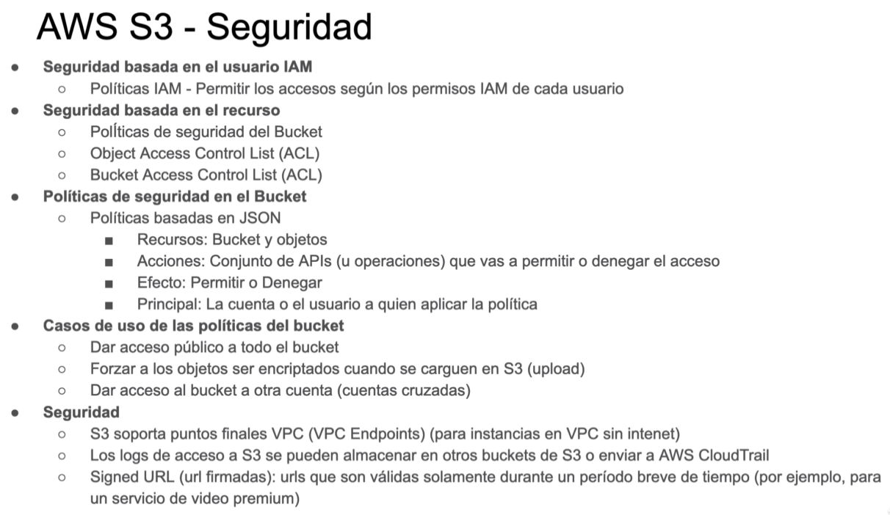

# CURSO AWS

## S3 - Acceso publico
 - Se necesita cambiar los permisos del bucket en Bloquear acceso público (desmarcar la opción seleccionada) y Editar la propiedad del objeto(ACL habilitadas). Después editar los permisos del objeto para todo el mundo 

## S3 - Ciclo de vida
- Dentro del bucket, en el módulo Administración, se pueden agregar las reglas de ciclo de vida


## Comandos cli
- Listar buckets s3
```
    aws s3 ls
    aws s3 ls s3://nombre_bucket
```
- Subir archivos a s3
```
    aws s3 cp /ruta_local_del_archivo s3://nombre_bucket/ruta
```
- [Mas comandos cli](https://aws.amazon.com/es/cli/)

## S3 - Encriptación
- Se puede encriptar el bucket al crearlo ó cada que se suba un archivo
- 

## S3 - Seguridad
- 

## Balanceadores de carga

# SQS Servicio de colas de mensajes
- Colas estandar procesamiento máximo y entrga asegurada, pero no respetan el orden en que fueron enviadas
- Colas FIFO


# SNS Servicio de notificación simple

# SES Simple Email Service

Función Lambda -> evitar conecciones a la base de datos desde la función lambda